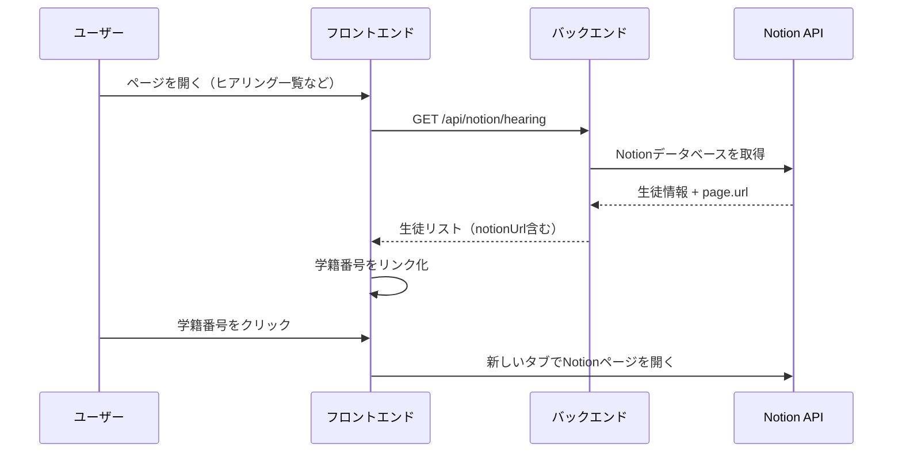

# 🔗 Notion URL リンク機能 - 実装完了

## ✨ 概要

**学籍番号をクリックするだけで、Notionページを直接開ける**機能を実装しました。

---

## 📍 実装対象

以下の3つの画面で学籍番号がリンク化されました：

### 1. **🎤 ヒアリング一覧**
- 4ヶ月目・10ヶ月目の生徒
- 学籍番号をクリック → 対応するNotionページが新しいタブで開く

### 2. **📋 延長審査一覧**
- 5ヶ月目・11ヶ月目の生徒
- 学籍番号をクリック → 対応するNotionページが新しいタブで開く

### 3. **👥 生徒情報マスタ**
- 全生徒の情報
- 学籍番号をクリック → 対応するNotionページが新しいタブで開く

---

## 🛠️ 技術実装

### バックエンド

#### Notion Service (`server/services/notionService.js`)
- **Notion API**から生徒情報を取得する際に、自動的に`page.url`（NotionページURL）を取得
- 各生徒データに`notionUrl`プロパティとして追加

```javascript
return {
  id: page.id,
  studentId: getPropertyValue(properties['学籍番号']),
  name: getPropertyValue(properties['名前']),
  // ... その他のフィールド
  notionUrl: page.url,  // 👈 NotionページのURL
};
```

#### API Routes (`server/routes/notion.js`)
- `/api/notion/hearing` - ヒアリング一覧用
- `/api/notion/examination` - 延長審査一覧用
- `/api/notion/students` - 生徒情報マスタ用

すべてのエンドポイントで`notionUrl`を含むデータを返却します。

---

### フロントエンド

#### StudentTable コンポーネント (`src/components/StudentTable.jsx`)
ヒアリング一覧・延長審査一覧で使用される共通テーブルコンポーネント

**学籍番号の表示ロジック:**
```jsx
<td className="px-2 py-1 whitespace-nowrap text-xs font-medium text-gray-900">
  {student.notionUrl ? (
    <a
      href={student.notionUrl}
      target="_blank"
      rel="noopener noreferrer"
      className="text-blue-600 hover:text-blue-800 hover:underline"
      title="Notionページを開く"
    >
      {student.studentId}
    </a>
  ) : (
    <span>{student.studentId}</span>
  )}
</td>
```

**特徴:**
- `notionUrl`が存在する場合 → 青色のリンク（ホバーで下線）
- `notionUrl`が存在しない場合 → 通常のテキスト表示
- `target="_blank"` → 新しいタブで開く
- `rel="noopener noreferrer"` → セキュリティ対策
- `title`属性 → ホバー時に「Notionページを開く」と表示

---

#### StudentMaster コンポーネント (`src/components/StudentMaster.jsx`)
生徒情報マスタで使用

**学籍番号の表示ロジック:**
```jsx
<td className="px-6 py-4 whitespace-nowrap text-sm font-medium text-gray-900">
  {student.notionUrl ? (
    <a
      href={student.notionUrl}
      target="_blank"
      rel="noopener noreferrer"
      className="text-blue-600 hover:text-blue-800 hover:underline"
      title="Notionページを開く"
    >
      {student.studentId}
    </a>
  ) : (
    <span>{student.studentId}</span>
  )}
</td>
```

---

## 🎨 UI/UX

### デザイン
- **通常時**: 青色のテキスト (`text-blue-600`)
- **ホバー時**: 濃い青色 + 下線 (`hover:text-blue-800 hover:underline`)
- **ツールチップ**: 「Notionページを開く」と表示

### 動作
1. 学籍番号をクリック
2. 新しいタブでNotionページが開く
3. 現在のページは保持される（戻る必要なし）

### フォールバック
- Notion URLが取得できていない生徒の場合 → 通常のテキスト表示（リンクなし）

---

## ✅ テスト項目

### 機能確認
- [ ] ヒアリング一覧で学籍番号をクリック → Notionページが新しいタブで開く
- [ ] 延長審査一覧で学籍番号をクリック → Notionページが新しいタブで開く
- [ ] 生徒情報マスタで学籍番号をクリック → Notionページが新しいタブで開く

### UI確認
- [ ] 学籍番号が青色で表示される
- [ ] マウスホバー時に下線が表示される
- [ ] ツールチップ「Notionページを開く」が表示される

### エラーハンドリング
- [ ] Notion URLがない生徒の学籍番号は通常のテキストとして表示される
- [ ] リンクをクリックしてもエラーが発生しない

---

## 📊 動作フロー



---

## 🔧 変更ファイル

### バックエンド
- `server/services/notionService.js` - 既に`notionUrl`を取得済み（変更なし）
- `server/routes/notion.js` - 既に`notionUrl`を返却済み（変更なし）

### フロントエンド
- ✅ `src/components/StudentTable.jsx` - 学籍番号をリンク化
- ✅ `src/components/StudentMaster.jsx` - 学籍番号をリンク化

---

## 🚀 デプロイ情報

- **コミット**: `4c2e762` - feat: Add Notion URL links to student ID in all lists
- **GitHub**: https://github.com/kyo10310415/extended-management
- **アプリURL**: https://extended-management.onrender.com/

---

## 🎯 期待される効果

### 業務効率化
- ✅ 学籍番号から直接Notionページへアクセス可能
- ✅ ページ間の移動が不要（新しいタブで開く）
- ✅ 生徒情報の確認が高速化

### ユーザビリティ向上
- ✅ 直感的な操作（クリックするだけ）
- ✅ 視覚的にわかりやすい（青色のリンク）
- ✅ 安全な動作（セキュリティ対策済み）

---

## 📝 今後の拡張案

### 優先度：低
- [ ] Notionアイコン（🔗）を学籍番号の横に追加
- [ ] クリック時のアニメーション効果
- [ ] リンククリック数のトラッキング

---

## 🎉 まとめ

✅ **実装完了！**

- **ヒアリング一覧**
- **延長審査一覧**
- **生徒情報マスタ**

の3つすべてで、学籍番号をクリックするだけでNotionページが開けるようになりました！

**デプロイ済み** - 本番環境で今すぐ利用可能です 🚀

---

**実装日**: 2026-01-20  
**担当**: AI Developer  
**コミット**: `4c2e762`
